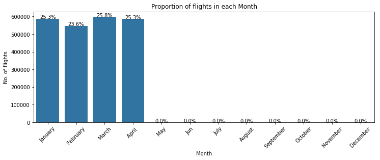
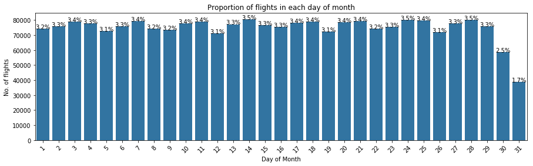
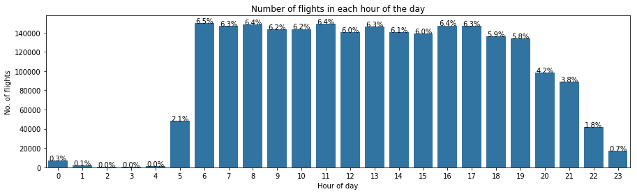
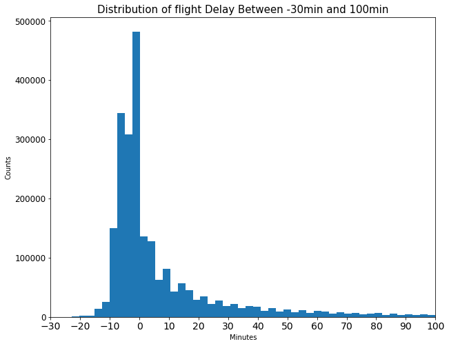
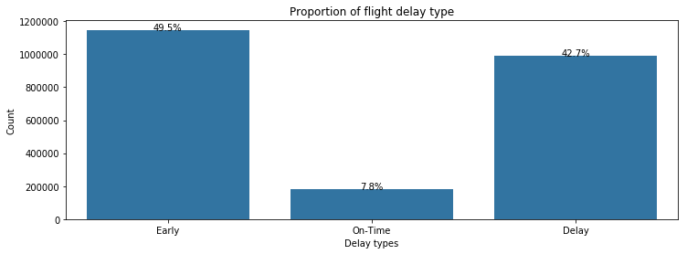

# 2008 Airline On-Time Performance Data Exploration 
## by Hiba Chafroud

## Dataset

The data that I worked consists of 4 csv files;

* 'airport.csv' contains data about airports.
* 'flights-2008.csv' contains data about flighs in the year 2008 ,such as departure and arriavale time, flight number , cancelation and others.
* 'carriers.csv' contains data about airlines.
* 'plane-data.csv' contains data about planes such as tail number, model rngine type and others.

The dataset can be found here(https://community.amstat.org/jointscsg-section/dataexpo/dataexpo2009).
Following this link ,i found data about flight arrival and departure details for all commercial flights on major carriers within the USA, from October 1987 to April 2008. This is a large dataset containing nearly 120 million records in total and takes 1.5G .So for memory problem i choose to work with the latest date available which is 2008.

Fro the data wrangling part ,i did Data assessment.I found some quality issues and to solve them i drop Nan values, duplicates and unnecessary columns and as for tidiness issues i  changed erroneous datatypes.

## Summary of Findings

####  Analyzing flights reginstations in days per week.

On weekends , flight registarion is at its lowest compared to weekdays.

####  Number of flights per month.

There isn't much to say about number of flights per month since we don't have full year records.

####  Number of flights per days in month.

On the 29th ,30th and 31th of the month flights registrations tend to decrease and the have high probabilty to be delayed.

####  Number of flights per hour in day.

Flights registation is nearly zero from midnight to 5Am , it has high delay pecentage too (nearly 80%).

####  Early flights?

Flights do really take off early and that is represented with the negative values.

#### Percentage of early and in-time take off 

More than 57% of flight can make early or on-time take off .

####  Delays per days?

On fridays more than 50% of the flight make delay.

[!img](fig/delay_day.png)

####  Most visited airport?

Atlanta Airport is on the hight visited airport with 267,704 total flights , its on the top for both in-bound and out-bound.

####  Number of flights per Airlines.

Southwest Airlines Co. had the most registered flights (393,732flights) but when compared to airlines delay, it had the least percentage of on-time and early flights.

[!img](fig/flight_airline.png)

#### Delays per Airlines?

When looking at delays, both Hawaiian Airlines Inc. and Aloha Airlines Inc hlow delay percentage while the both have low flights resigtrations.

[!img](fig/delay_airline.png)

## Key Insights for Presentation

For the presentation, I focus on just the number of flights per days of week ,month ,hours of the day and airlines.

Afterwards, I focus on early flighs and the desribution of delay values, delays per days,hours and per airlines.
