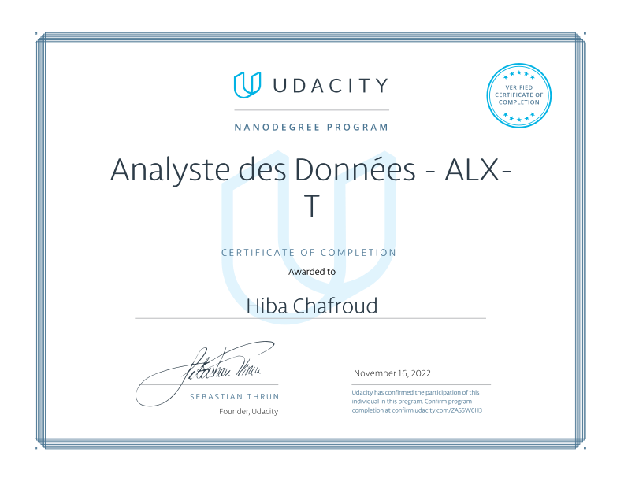

# Data Analyst Nanodegree

ALX-T Data Analyst Nanodegree is a 3 month project based programme handled in collaboration with Udacity. It's aimed at equipping Africans with a solid knowledge of a Tech Specialization and also accelerating their career progress.

This repo contains the case studies and projects carried during the course of this Nanodegree programme.

## Contents

### [P1: Investigate-Kaggle-TMDB-movie-dataset](https://github.com/hibachafroud/Data-Analyst-Nanodegree/tree/main/Investigate-Kaggle-TMDB-movie-dataset)

Investigation TMDB movie dataset in order to get useful information for analysis.

### [P2: WeRateDogs](https://github.com/hibachafroud/Data-Analyst-Nanodegree/tree/main/WeRateDogs)

This project is about wrangling, analysing and visualizing data from various sources.

### [P3: Airline On-Time Performance](https://github.com/hibachafroud/Data-Analyst-Nanodegree/tree/main/Airline%20On-Time%20Performance)

This project is about data wrangling and using data visualizations tools to get useful information the can be used for analysis.

